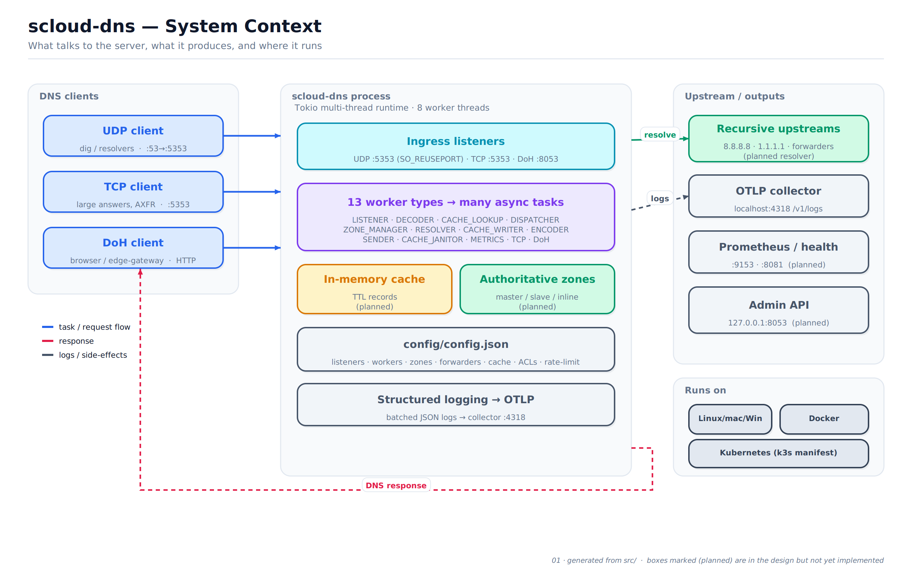
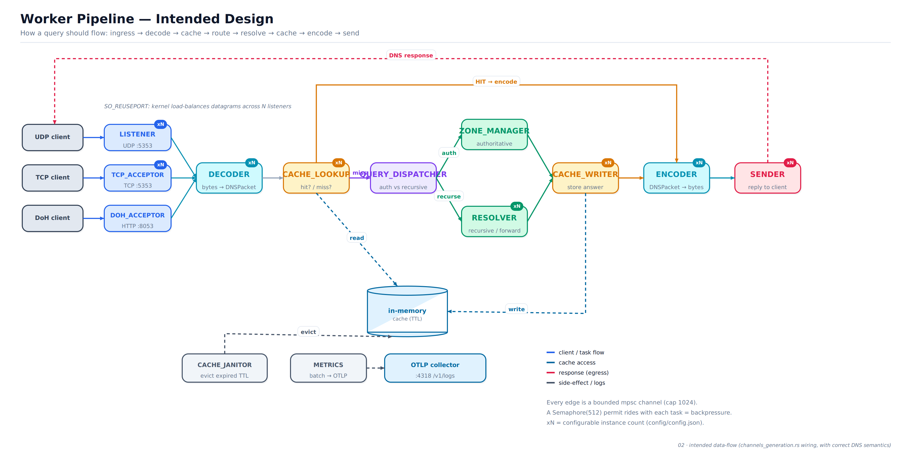
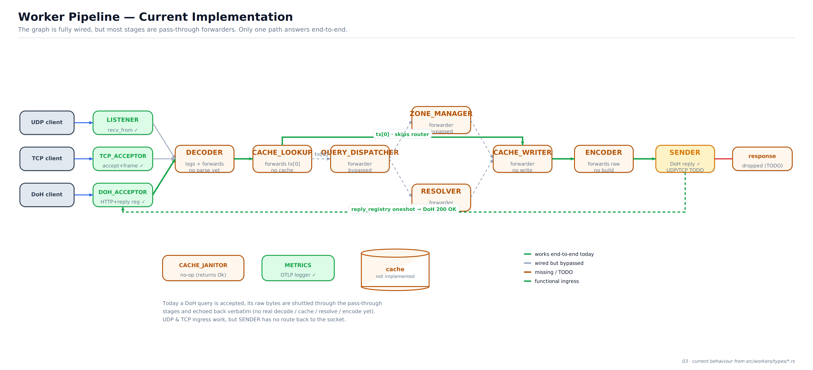
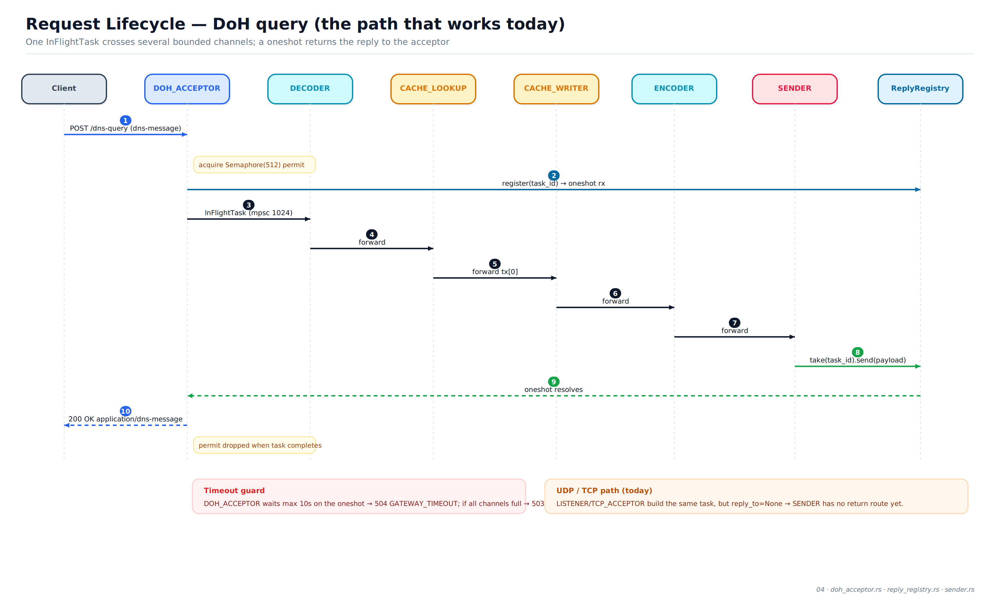
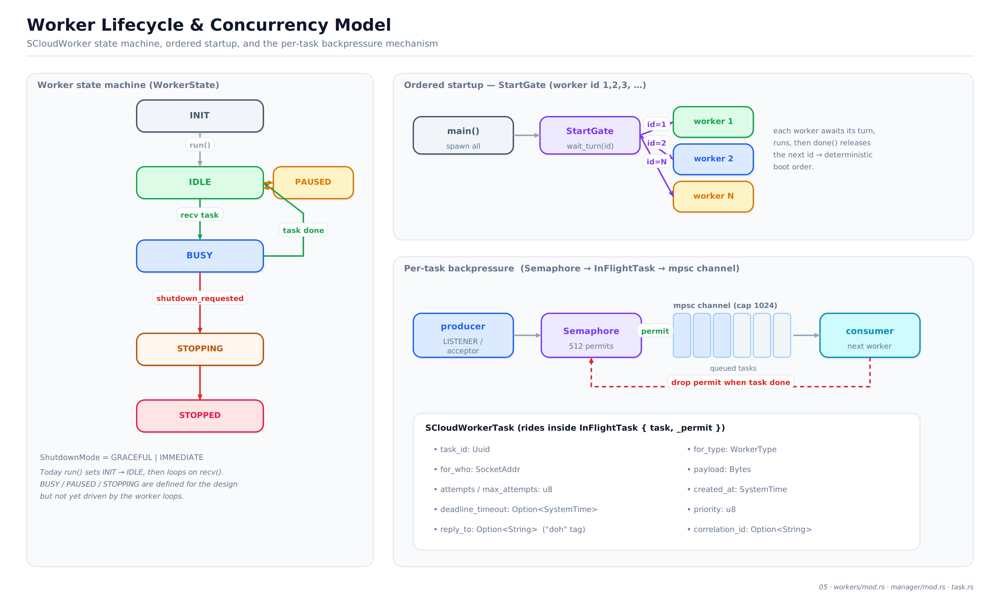
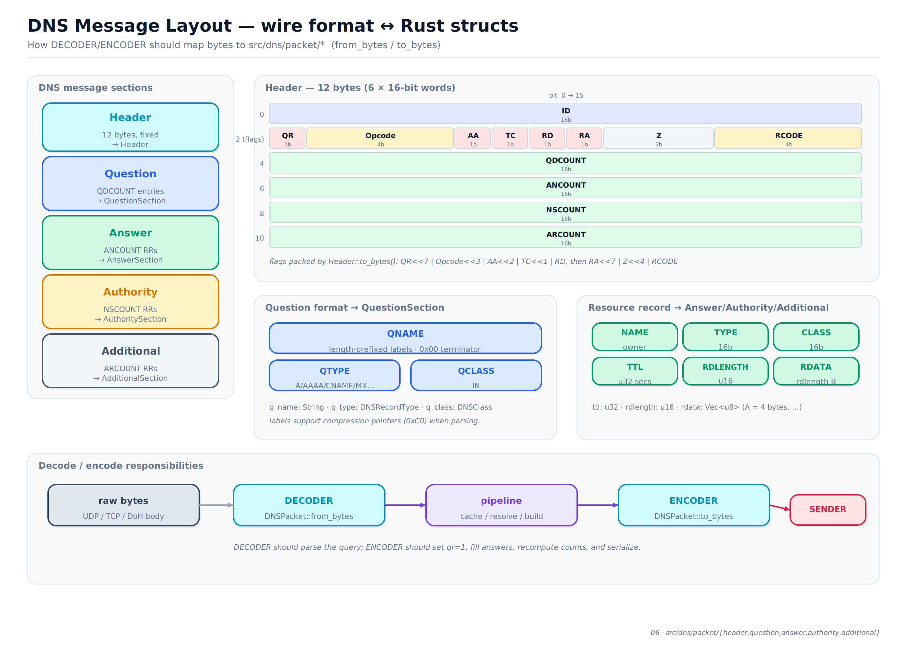

# scloud-dns — Architecture Diagrams

Visual documentation of how `scloud-dns` works today and how it is meant to
work once the pipeline stages are fully implemented. Every diagram is available
as **SVG** (vector, best for zooming / editing) and **PNG** (2× hi-DPI raster,
best for embedding).

The diagrams are generated from the actual source in [`src/`](../../src) — see
[Regenerating](#regenerating) below.

> **Note on the top-level README:** the project `README.md` links workers to
> `src/threads/mod.rs`. That module was refactored into
> [`src/workers/`](../../src/workers); the diagrams here reflect the current
> `src/workers/` layout.

---

## Index

| # | Diagram | Answers | Source of truth |
|---|---------|---------|-----------------|
| 01 | System Context | Who talks to the server, what it emits, where it runs | `main.rs`, `config/config.json`, `k3s/` |
| 02 | Worker Pipeline — **Intended** | How a query *should* flow end-to-end | `workers/manager/channels_generation.rs` |
| 03 | Worker Pipeline — **Current** | What actually happens today (stubs vs. real) | `workers/types/*.rs` |
| 04 | Request Lifecycle | A single DoH query, step by step | `doh_acceptor.rs`, `reply_registry.rs`, `sender.rs` |
| 05 | Worker Lifecycle & Concurrency | State machine, ordered startup, backpressure | `workers/mod.rs`, `manager/mod.rs`, `task.rs` |
| 06 | DNS Message Layout | Wire format ↔ Rust structs | `dns/packet/*` |

---

### 01 · System Context


The big picture: UDP / TCP / DoH clients on one side, the single `scloud-dns`
process (Tokio, 8 worker threads) in the middle, and upstreams / outputs
(recursive resolvers, OTLP collector, metrics, admin) on the other. Boxes marked
**(planned)** exist in `config/config.json` and the design but are not wired into
the runtime yet. Deployment targets: bare metal, Docker, and Kubernetes (`k3s/`).

### 02 · Worker Pipeline — Intended Design


The target data-flow, matching the channel wiring in
`channels_generation.rs` with correct DNS semantics:

```
ingress → DECODER → CACHE_LOOKUP ─(hit)→ ENCODER
                          └(miss)→ QUERY_DISPATCHER → ZONE_MANAGER  ┐
                                                    → RESOLVER      ┴→ CACHE_WRITER → ENCODER → SENDER → client
```

* Ingress scales horizontally via `SO_REUSEPORT` (run more `LISTENER` /
  `TCP_ACCEPTOR` workers — the `xN` badges).
* Every arrow is a bounded `tokio::mpsc` channel (capacity **1024**).
* A `Semaphore(512)` permit travels with each task for backpressure.
* `CACHE_JANITOR` evicts expired TTLs; `METRICS` batches logs to an OTLP
  collector. Neither sits on the hot request path.

### 03 · Worker Pipeline — Current Implementation


Reality check. The graph is **fully wired**, but most stages are currently
**pass-through forwarders** — they move the task to the next channel without
doing DNS work yet:

* **Functional:** `LISTENER` (UDP recv), `TCP_ACCEPTOR` (accept + length
  framing), `DOH_ACCEPTOR` (full HTTP, registers a reply channel), `METRICS`
  (OTLP logger).
* **Pass-through stubs:** `DECODER` (logs bytes, no parse), `CACHE_LOOKUP`,
  `QUERY_DISPATCHER`, `ZONE_MANAGER`, `RESOLVER`, `CACHE_WRITER`, `ENCODER`.
* **No-op:** `CACHE_JANITOR`.
* **Partial:** `SENDER` returns DoH replies via `reply_registry`, but the
  UDP/TCP return path is `TODO` (`reply_to = None`).

The **green path** is the only route that answers end-to-end today: a DoH query
is shuttled through the forwarders and echoed back verbatim. `CACHE_LOOKUP`
forwards on `tx[0]` (= `CACHE_WRITER`) first, so the router/resolver detour is
effectively skipped. UDP/TCP ingress works, but responses are dropped.

### 04 · Request Lifecycle (DoH)


A sequence view of the one working path: permit acquisition, `reply_registry`
`oneshot` registration, the hops across channels, and the reply returning to the
acceptor. Includes the 10s timeout guard (→ `504`) and a note on why the
UDP/TCP path can't reply yet.

### 05 · Worker Lifecycle & Concurrency Model


Three mechanisms in one page:
* **`WorkerState`** machine (`INIT → IDLE → BUSY … → STOPPED`). Today `run()`
  only drives `INIT → IDLE`; the rest are defined for the design.
* **`StartGate`** — deterministic, ordered startup by worker id.
* **Per-task backpressure** — `Semaphore` → `InFlightTask { task, _permit }` →
  bounded `mpsc` channel → consumer, with the permit dropped on completion. Also
  lists the `SCloudWorkerTask` fields.

### 06 · DNS Message Layout


Protocol reference for the `DECODER`/`ENCODER` work: the 12-byte header bit
layout, the five message sections, question and resource-record formats, and how
each maps to the structs in `src/dns/packet/*` (`from_bytes` / `to_bytes`).

---

## Regenerating

The diagrams are drawn programmatically with [pycairo] — no Graphviz, Mermaid,
or headless browser required. One draw pass produces both the SVG and the PNG,
so they never drift apart.

```bash
# needs: python3 + pycairo  (pip install pycairo)
python3 docs/architecture/generate.py
```

* [`generate.py`](generate.py) — one `d0x(ctx)` function per diagram.
* [`diagramlib.py`](diagramlib.py) — the tiny box/arrow/panel toolkit and the
  `render()` helper that emits SVG + 2× PNG.

When the pipeline logic changes, update the corresponding `d0x` function so
these diagrams stay honest about *how it works* vs. *how it should work*.

[pycairo]: https://pycairo.readthedocs.io/
